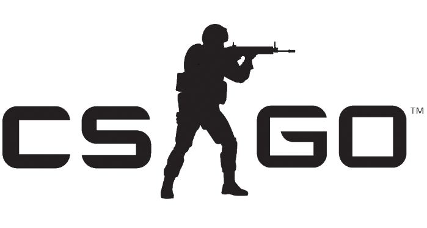

# CS:GO Config
Put *autoexec.cfg* in `...\Steam\steamapps\common\Counter-Strike Global Offensive\csgo\cfg` or take what you want from it and add to your autoexec config! 

After the Wild West Simulator 2015 update, *video.txt* needs to be put in `...\Steam\userdata\<Steam3 ID>\730\local\cfg` 

Put *video.txt* `...\Steam\userdata\yourID\730\local\cfg`

### Launch Options

	-novid -high -threads 4 -freq 144 -refresh 144  -nojoy -nod3d9ex +exec autoexec.cfg

Enter launch options at `Steam > Library > Counter-Strike: Global Offensive (right-click) > Properties > Set Launch Options...`

### Other Settings
+ Windows Sensitivity: 7/11
+ Mouse DPI: 1600
+ Windows 7 Aero: No - `csgo.exe Properties > Compatibility > Disable visual themes & Disable desktop composition`
+ I play at 2560x1440 
+ [ClearRadar by /u/adoscafeten](http://www.csmeta.com/clearradar/)
+ [SLAM Source Live Audio Mixer](https://github.com/SilentSys/SLAM)

# 
